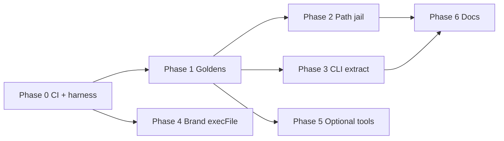

# Security Hardening & Test Coverage — Master Plan

> **Purpose:** Task tracking, PR sequencing, and session recovery for non-breaking security hardening of UI/UX Pro Max.
>
> **Last updated:** 2026-05-18 (workflow: single upstream PR when plan complete)  
> **Owner:** _(assign name)_  
> **Branch convention:** `feat/security-hardening-*` or `test/characterization-baseline` — never commit directly to `main`.

---

## How to recover a disrupted session

1. **Read this section first** — note `Current focus` and `Last completed task` below.
2. **Run status checks** (no code changes):
   ```bash
   git status && git branch --show-current
   pytest tests/python -q 2>/dev/null || echo "pytest not set up yet"
   cd cli && bun test 2>/dev/null || echo "cli tests not set up yet"
   ```
3. **Find the first unchecked task** in [Task backlog](#task-backlog) whose dependencies are done.
4. **Update this file** when you start or finish a task (checkbox + `Last completed task` + date).
5. **Do not open upstream PRs** until [Final upstream PR](#final-upstream-pr) checklist is complete (phases 0–6 done, `make test` green).

### Session state (update every time you stop)

| Field | Value |
|-------|--------|
| **Current focus** | **Open PR-FINAL** to upstream when ready |
| **Last completed task** | **T-063** — Phases 0–6 complete on `feat/security-hardening` (2026-05-18) |
| **Integration branch** | `feat/security-hardening` |
| **Upstream PR** | **Not opened** — use [Final upstream PR](#final-upstream-pr) checklist |
| **Blockers** | none |
| **Notes for next session** | `make test` → 33 Python + 6 CLI. Close draft #313/#314 if still open. One `gh pr create` with phases table. Rebase on `origin/main` before opening. |

### Quick context

- **Security review summary:** Core search is read-only CSV + BM25; no malware found. Risks: path traversal on `--persist`, shell in legacy ZIP extract, optional Gemini/`npx`, CSV prompt-injection (agent-level).
- **Remediation principle:** Fail safe on bad paths; no change for valid inputs; fix `src/ui-ux-pro-max/` then sync `cli/assets/`.
- **Testing principle:** Characterization/golden tests **before** hardening; security-negative tests **with** each hardening phase (same branch).
- **Upstream PR principle:** Complete phases **locally** on one integration branch; open **one** well-structured PR to upstream when the full plan is done (see below).

---

## Workflow: local phases, single upstream PR

Phases 0–6 are **internal milestones** for task tracking and commit discipline—not separate upstream PRs.

| Stage | What you do | Push to fork? |
|-------|-------------|---------------|
| **During work** | Implement phase by phase; commit on `feat/security-hardening` (or merge phase branches locally) | Optional: push fork branch for backup only |
| **Per phase** | Run `make test`; update task table + session state | No upstream PR required |
| **Plan complete** | Rebase on upstream `main`; one PR body covering all phases | **Yes** — single PR to `nextlevelbuilder/ui-ux-pro-max-skill` |

**Why:** Upstream is not your repo; one complete, reviewable PR reduces noise and makes the full security + test story easier to accept.

**Early PRs (#313, #314):** If already opened, close as **draft** or close with a short comment (“consolidating into single PR when plan complete”)—not required for local progress.

### Integration branch setup

```bash
git fetch origin
git checkout -b feat/security-hardening origin/main
# merge or cherry-pick completed phase work:
# git merge test/phase-0-harness-and-contributing
# git merge test/phase-1-golden-fixtures
# continue Phase 2–6 on feat/security-hardening
```

---

## Status legend

| Symbol | Meaning |
|--------|---------|
| ⬜ | Not started |
| 🔄 | In progress |
| ✅ | Done |
| ⏸️ | Blocked |
| ❌ | Cancelled / won’t do |

---

## Phase overview

| Phase | Goal | Upstream PR | Depends on |
|-------|------|-------------|------------|
| **0** | Test harness + CI that runs | _(local)_ | — |
| **1** | Characterization / golden baseline (no hardening) | _(local)_ | Phase 0 |
| **2** | Path jail for `--persist` | _(local)_ | Phase 1 |
| **3** | CLI extract hardening (no shell) | _(local)_ | Phase 1 |
| **4** | Brand sync `execFile` | _(local)_ | Phase 0 |
| **5** | Optional tools (shadcn allowlist, SVG sanitize) | _(local)_ | Phase 1 (partial) |
| **6** | Documentation & process | _(local)_ | Any |
| **Final** | Open **one** upstream PR | **PR-FINAL** | Phases 0–6 ✅ |



---

## Task backlog

### Phase 0 — Test harness & CI

| ID | Status | Task | Acceptance criteria | Files / notes |
|----|--------|------|---------------------|---------------|
| T-001 | ✅ | Add root `tests/python/` layout + `conftest.py` (path to `src/ui-ux-pro-max/scripts`) | `pytest tests/python` collects tests | `tests/python/conftest.py` |
| T-002 | ✅ | Add `pyproject.toml` or `pytest.ini` (`testpaths`, pythonpath) | Single command runs from repo root | Root `pyproject.toml` |
| T-003 | ✅ | Add `cli` test runner (`bun test` or vitest) + `test` script in `cli/package.json` | `bun test tests/cli` passes | `cli/package.json`, `tests/cli/` |
| T-004 | ✅ | Replace/fix `.github/workflows/python-package-conda.yml` → `test.yml` (Python 3.11 + Bun, no conda) | CI green on PR | `.github/workflows/test.yml` |
| T-005 | ✅ | Add `make test` or root script documenting commands | README or Makefile lists `make test`, `make test-golden` | Root `Makefile` |

**Phase 0 exit:** ✅ CI runs on PR; smoke tests pass (3 Python + 1 CLI).

---

### Phase 1 — Characterization baseline (no security code changes)

| ID | Status | Task | Acceptance criteria | Files / notes |
|----|--------|------|---------------------|---------------|
| T-010 | ✅ | Golden: `search()` for 3–5 fixed queries (JSON fixtures) | Changing ranking without intent fails CI | `tests/python/golden/fixtures/*.json` |
| T-011 | ✅ | Unit: `detect_domain()` table-driven | All keyword→domain cases pass | `tests/python/unit/test_detect_domain.py` |
| T-012 | ✅ | Integration: `persist` with `-p "My App" --page "User Profile"` | Files at `design-system/my-app/...` | `tests/python/unit/test_design_system_persist.py` |
| T-013 | ✅ | Golden: `--design-system` output hash/snapshot (no `--persist`) | Stable across runs | `tests/python/golden/snapshots/design_system_fintech_saas.md` |
| T-014 | ✅ | CLI: template render snapshot for `cursor` + `claude` | SKILL.md key lines match snapshot | `tests/cli/template-render.test.ts` |
| T-015 | ✅ | CLI: `generatePlatformFiles` smoke (temp dir) | Expected folders + SKILL.md exist | Same file (template install path) |
| T-016 | ✅ | `make test-golden` runs golden suite | Documented in CONTRIBUTING | `Makefile` |

**Phase 1 exit:** Goldens locked on integration branch. **Do not start hardening (Phase 2) before Phase 1 tests pass.**

---

### Phase 2 — Path jail (`--persist`)

| ID | Status | Task | Acceptance criteria | Files / notes |
|----|--------|------|---------------------|---------------|
| T-020 | ✅ | Implement `safe_slug()` helper | `[a-z0-9-]+`, collapse dashes, fallback | `path_utils.py` |
| T-021 | ✅ | Implement `assert_under_dir(resolved, base)` jail | Raises clear error on escape | `path_utils.py` |
| T-022 | ✅ | Apply to `project_slug`, `page` filename, `output_dir` | T-012 goldens still pass | `design_system.py` |
| T-023 | ✅ | Sync to `cli/assets/scripts/` | `design_system.py`, `path_utils.py` | synced |
| T-024 | ✅ | Security tests: `..`, slashes, absolute segments rejected | No file outside `design-system/` | `tests/python/security/` |
| T-025 | ✅ | Document valid slug rules in error message | `PathTraversalError` messages | `path_utils.py` |

**Phase 2 exit:** ✅ T-010–T-013 and T-024 green.

---

### Phase 3 — CLI extract / legacy install

| ID | Status | Task | Acceptance criteria | Files / notes |
|----|--------|------|---------------------|---------------|
| T-030 | ✅ | Replace `exec` string unzip with `execFile` + argv | No shell metachar in command string | `cli/src/utils/extract.ts` |
| T-031 | ✅ | Validate `zipPath` / `destDir` before extract | Absolute paths; zip exists | Same |
| T-032 | ✅ | Tests assert no shell unzip / copy | Source + structure checks | `tests/cli/extract.test.ts` |
| T-033 | ❌ | Fixture: minimal zip in `tests/fixtures/` | Deferred — not required for argv hardening | — |
| T-034 | ✅ | One-time warn on `--legacy` (stderr or ora) | Default install unchanged | `cli/src/commands/init.ts` |
| T-035 | ❌ | _(Optional)_ Verify SHA256 when release ships checksums | Deferred — no upstream checksum file yet | — |

**Phase 3 exit:** ✅ T-014–T-015 and T-032 green.

---

### Phase 4 — Brand sync subprocess

| ID | Status | Task | Acceptance criteria | Files / notes |
|----|--------|------|---------------------|---------------|
| T-040 | ✅ | Replace `execSync` template string with `execFileSync('node', [...])` | No shell interpolation | `.claude/skills/brand/scripts/sync-brand-to-tokens.cjs` |
| T-041 | ❌ | Smoke test with mocked `child_process` | Deferred — low risk script | — |

**Phase 4 exit:** ✅

---

### Phase 5 — Optional tool guards

| ID | Status | Task | Acceptance criteria | Files / notes |
|----|--------|------|---------------------|---------------|
| T-050 | ✅ | shadcn component allowlist `^[a-z0-9-]+$` | Invalid name fails before subprocess | `shadcn_add.py` + `test_shadcn_add.py` |
| T-051 | ✅ | SVG sanitize: strip `<script>`, event handlers | Malicious sample neutralized | `icon/generate.py` |
| T-052 | ✅ | Extend existing ui-styling tests for allowlist | `test_add_components_rejects_invalid_names` | skill tests dir |

**Phase 5 exit:** ✅

---

### Phase 6 — Documentation & process

| ID | Status | Task | Acceptance criteria | Files / notes |
|----|--------|------|---------------------|---------------|
| T-060 | ✅ | Add `SECURITY.md` (threat model + trust boundaries) | Linked from README | `SECURITY.md` |
| T-061 | ✅ | README: install trust order (vendored > template > `--legacy`) | Contributing section | `README.md` |
| T-062 | ✅ | CONTRIBUTING: review CSV for prompt-injection patterns | SECURITY.md + CONTRIBUTING | done |
| T-063 | ✅ | Mark all tasks ✅ in this doc; set **Project complete** | — | This file |

---

## Coverage targets (reference)

| Scope | Target | Enforced in CI? |
|-------|--------|------------------|
| New security helpers (`safe_slug`, jail) | ≥ 95% | Yes, when added |
| `src/ui-ux-pro-max/scripts/*.py` | ≥ 80% | Phase 1+ (aspirational) |
| `cli/src/**/*.ts` | ≥ 80% | Phase 1+ |
| CSV / SKILL.md / Gemini scripts | Not required | No |

**Explicit non-goals:** 100% repo coverage; real network Gemini; real `npx shadcn` in CI.

---

## Final upstream PR

Open **only when phases 0–6 are complete** (or 0–4 + 6 if Phase 5 skipped with reason in Decisions log).

| Resource | Purpose |
|----------|---------|
| [CONTRIBUTING.md](../CONTRIBUTING.md) | Fork workflow, PR template, general repo rules |
| [.github/pull_request_template.md](../.github/pull_request_template.md) | Auto-filled PR body — **do not strip sections** |
| This plan | Task IDs completed; phase summary for reviewers |

**Suggested title (single PR):**

`test+fix(security): hardening, golden tests, CI, and contributor docs`

**Suggested PR structure (sections in description):**

1. **Summary** — Full initiative in 3–5 sentences  
2. **Phases delivered** — Table: Phase → what changed → task IDs  
3. **Security fixes** — Path jail, CLI extract, brand execFile, optional Phase 5  
4. **Test plan** — `make test`, golden/security test paths  
5. **Breaking / behavior** — Explicitly “non-breaking for valid inputs”  
6. **Review guide** — Order of files to read  

After merge, ask maintainers to enable branch protection requiring **Test** on `main`.

### Final upstream PR checklist

```markdown
- [ ] All phases 0–6 complete (or 5 skipped with note)
- [ ] Branch `feat/security-hardening` rebased on latest upstream `main`
- [ ] `make test` green locally
- [ ] `cli/assets/` synced if `src/ui-ux-pro-max/` changed
- [ ] PR body lists every completed T-xxx ID
- [ ] Golden updates explained (if any fixture changed in Phase 2+)
- [ ] Session state in this plan marked COMPLETE
- [ ] Early draft PRs #313 / #314 closed or superseded (if applicable)
```

### Per-phase commit checklist (local only)

Use while working—**no upstream PR per phase**:

```markdown
- [ ] Phase N tasks checked in this plan
- [ ] `make test` green
- [ ] Commit on integration branch with message: test|fix: Phase N — <short description>
- [ ] Session state updated
```

---

## File touch map (avoid missed sync)

| Source of truth | Sync/copy to |
|-----------------|--------------|
| `src/ui-ux-pro-max/scripts/*.py` | `cli/assets/scripts/` |
| `src/ui-ux-pro-max/data/*` | `cli/assets/data/` (when data changes) |
| `src/ui-ux-pro-max/templates/*` | `cli/assets/templates/` (when templates change) |

After Python script edits in Phase 2:

```bash
cp src/ui-ux-pro-max/scripts/design_system.py cli/assets/scripts/design_system.py
```

---

## Commands cheat sheet

```bash
# Status
git status && git branch --show-current

# Python tests (after Phase 0)
pytest tests/python -v
pytest tests/python/golden -v          # characterization only
pytest tests/python/security -v      # negative security cases
pytest tests/python --cov=src/ui-ux-pro-max/scripts --cov-report=term-missing

# CLI tests (after Phase 0)
cd cli && bun test

# Core skill smoke (manual)
python3 src/ui-ux-pro-max/scripts/search.py "saas dashboard" --domain product
python3 src/ui-ux-pro-max/scripts/search.py "fintech" --design-system -p "Test App"

# CLI smoke (manual, local project)
cd /tmp/uipro-test && npx uipro init --ai cursor --offline
```

---

## Decisions log

Record irreversible choices here so future sessions don’t re-debate.

| Date | Decision | Rationale |
|------|----------|-----------|
| 2026-05-18 | Characterization before hardening | Prevent accidental behavior drift |
| 2026-05-18 | No mandatory ZIP checksum until upstream publishes | Non-breaking |
| 2026-05-18 | **Single upstream PR** when plan complete (not per-phase PRs) | Less maintainer noise; full story in one review |
| _…_ | _…_ | _…_ |

---

## Project completion

- [x] All Phase 0–4 tasks ✅ (required)
- [x] Phase 5 ✅
- [x] Phase 6 ✅
- [ ] CI green on PR-FINAL (run after opening upstream PR)
- [x] Session state marked **COMPLETE** (pending upstream PR only)

---

## Related references

- Security review (conversation): path traversal, CLI shell, Gemini, `npx`, CSV injection
- Repo sync rules: `CLAUDE.md` (root)
- Existing tests: `.claude/skills/ui-styling/scripts/tests/`
