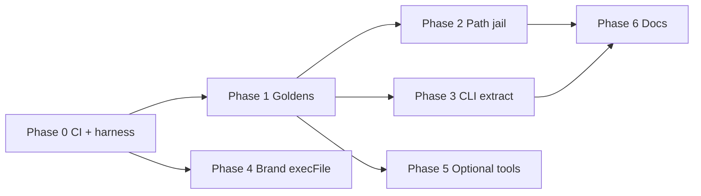

# Security Hardening & Test Coverage — Master Plan

> **Purpose:** Task tracking, PR sequencing, and session recovery for non-breaking security hardening of UI/UX Pro Max.
>
> **Last updated:** 2026-05-18 (Phase 0 complete)  
> **Owner:** _(assign name)_  
> **Branch convention:** `feat/security-hardening-*` or `test/characterization-baseline` — never commit directly to `main`.

---

## How to recover a disrupted session

1. **Read this section first** — note `Current focus` and `Last completed task` below.
2. **Run status checks** (no code changes):
   ```bash
   git status && git branch --show-current
   pytest tests/python -q 2>/dev/null || echo "pytest not set up yet"
   cd cli && bun test 2>/dev/null || echo "cli tests not set up yet"
   ```
3. **Find the first unchecked task** in [Task backlog](#task-backlog) whose dependencies are done.
4. **Update this file** when you start or finish a task (checkbox + `Last completed task` + date).
5. **Open the linked PR** in the task row if work is in flight on a branch.

### Session state (update every time you stop)

| Field | Value |
|-------|--------|
| **Current focus** | **PR-1** Phase 1 goldens — open PR after PR-0 merges (or stack on fork) |
| **Last completed task** | **T-016** — Phase 1 complete on `test/phase-1-golden-fixtures` (2026-05-18) |
| **Active branch** | `test/phase-1-golden-fixtures` (from Phase 0 branch) |
| **Active PR** | PR-0: #313 · PR-1: https://github.com/nextlevelbuilder/ui-ux-pro-max-skill/pull/314 |
| **Blockers** | Prefer PR-0 merge first; Phase 1 branch includes Phase 0 commits until rebased |
| **Notes for next session** | `make test` (24 Python + 4 CLI). Regenerate goldens: `python3 scripts/regenerate_goldens.py`. Next: open PR-1 or rebase onto upstream `main` after #313 merges. |

### Quick context

- **Security review summary:** Core search is read-only CSV + BM25; no malware found. Risks: path traversal on `--persist`, shell in legacy ZIP extract, optional Gemini/`npx`, CSV prompt-injection (agent-level).
- **Remediation principle:** Fail safe on bad paths; no change for valid inputs; fix `src/ui-ux-pro-max/` then sync `cli/assets/`.
- **Testing principle:** Characterization/golden tests **before** hardening; security-negative tests **with** each hardening PR.

---

## Status legend

| Symbol | Meaning |
|--------|---------|
| ⬜ | Not started |
| 🔄 | In progress |
| ✅ | Done |
| ⏸️ | Blocked |
| ❌ | Cancelled / won’t do |

---

## Phase overview

| Phase | Goal | PR(s) | Depends on |
|-------|------|-------|------------|
| **0** | Test harness + CI that runs | PR-0 | — |
| **1** | Characterization / golden baseline (no hardening) | PR-1 | Phase 0 |
| **2** | Path jail for `--persist` | PR-2 | Phase 1 |
| **3** | CLI extract hardening (no shell) | PR-3 | Phase 1 |
| **4** | Brand sync `execFile` | PR-4 | Phase 0 |
| **5** | Optional tools (shadcn allowlist, SVG sanitize) | PR-5 | Phase 1 (partial) |
| **6** | Documentation & process | PR-6 | Any |



---

## Task backlog

### Phase 0 — Test harness & CI

| ID | Status | Task | Acceptance criteria | Files / notes |
|----|--------|------|---------------------|---------------|
| T-001 | ✅ | Add root `tests/python/` layout + `conftest.py` (path to `src/ui-ux-pro-max/scripts`) | `pytest tests/python` collects tests | `tests/python/conftest.py` |
| T-002 | ✅ | Add `pyproject.toml` or `pytest.ini` (`testpaths`, pythonpath) | Single command runs from repo root | Root `pyproject.toml` |
| T-003 | ✅ | Add `cli` test runner (`bun test` or vitest) + `test` script in `cli/package.json` | `bun test tests/cli` passes | `cli/package.json`, `tests/cli/` |
| T-004 | ✅ | Replace/fix `.github/workflows/python-package-conda.yml` → `test.yml` (Python 3.11 + Bun, no conda) | CI green on PR | `.github/workflows/test.yml` |
| T-005 | ✅ | Add `make test` or root script documenting commands | README or Makefile lists `make test`, `make test-golden` | Root `Makefile` |

**Phase 0 exit:** ✅ CI runs on PR; smoke tests pass (3 Python + 1 CLI).

---

### Phase 1 — Characterization baseline (no security code changes)

| ID | Status | Task | Acceptance criteria | Files / notes |
|----|--------|------|---------------------|---------------|
| T-010 | ✅ | Golden: `search()` for 3–5 fixed queries (JSON fixtures) | Changing ranking without intent fails CI | `tests/python/golden/fixtures/*.json` |
| T-011 | ✅ | Unit: `detect_domain()` table-driven | All keyword→domain cases pass | `tests/python/unit/test_detect_domain.py` |
| T-012 | ✅ | Integration: `persist` with `-p "My App" --page "User Profile"` | Files at `design-system/my-app/...` | `tests/python/unit/test_design_system_persist.py` |
| T-013 | ✅ | Golden: `--design-system` output hash/snapshot (no `--persist`) | Stable across runs | `tests/python/golden/snapshots/design_system_fintech_saas.md` |
| T-014 | ✅ | CLI: template render snapshot for `cursor` + `claude` | SKILL.md key lines match snapshot | `tests/cli/template-render.test.ts` |
| T-015 | ✅ | CLI: `generatePlatformFiles` smoke (temp dir) | Expected folders + SKILL.md exist | Same file (template install path) |
| T-016 | ✅ | `make test-golden` runs golden suite | Documented in CONTRIBUTING | `Makefile` |

**Phase 1 exit:** PR-1 open / merge pending; goldens locked in branch. **Do not merge hardening before this.**

---

### Phase 2 — Path jail (`--persist`)

| ID | Status | Task | Acceptance criteria | Files / notes |
|----|--------|------|---------------------|---------------|
| T-020 | ⬜ | Implement `safe_slug()` helper | `[a-z0-9-]+`, collapse dashes, fallback | `design_system.py` (+ shared module if needed) |
| T-021 | ⬜ | Implement `assert_under_dir(resolved, base)` jail | Raises clear error on escape | Same |
| T-022 | ⬜ | Apply to `project_slug`, `page` filename, `output_dir` | T-012 goldens still pass | `src/ui-ux-pro-max/scripts/design_system.py` |
| T-023 | ⬜ | Sync to `cli/assets/scripts/design_system.py` | Byte-identical or copy per CLAUDE.md | `cp` after edit |
| T-024 | ⬜ | Security tests: `..`, slashes, absolute segments rejected | No file outside `design-system/` | `tests/python/security/test_path_traversal.py` |
| T-025 | ⬜ | Document valid slug rules in error message | User sees actionable stderr | — |

**Phase 2 exit:** PR-2 merged; T-010–T-013 green; T-024 green.

---

### Phase 3 — CLI extract / legacy install

| ID | Status | Task | Acceptance criteria | Files / notes |
|----|--------|------|---------------------|---------------|
| T-030 | ⬜ | Replace `exec` string unzip with `execFile` + argv | No shell metachar in command string | `cli/src/utils/extract.ts` |
| T-031 | ⬜ | Validate `zipPath` / `destDir` before extract | Absolute paths; zip exists | Same |
| T-032 | ⬜ | Unit tests with mocked `child_process` | Assert argv arrays, not shell strings | `tests/cli/extract.test.ts` |
| T-033 | ⬜ | Fixture: minimal zip in `tests/fixtures/` | Extract reproduces expected tree | Small binary in repo |
| T-034 | ⬜ | One-time warn on `--legacy` (stderr or ora) | Default install unchanged | `cli/src/commands/init.ts` |
| T-035 | ⬜ | _(Optional)_ Verify SHA256 when release ships checksums | Skip if file missing | `github.ts` — defer if no upstream asset |

**Phase 3 exit:** PR-3 merged; T-014–T-015 green; T-032–T-033 green.

---

### Phase 4 — Brand sync subprocess

| ID | Status | Task | Acceptance criteria | Files / notes |
|----|--------|------|---------------------|---------------|
| T-040 | ⬜ | Replace `execSync` template string with `execFileSync('node', [...])` | No shell interpolation | `.claude/skills/brand/scripts/sync-brand-to-tokens.cjs` |
| T-041 | ⬜ | Smoke test with mocked `child_process` | Correct argv | `tests/` or colocated |

**Phase 4 exit:** PR-4 merged (can parallelize with Phase 2–3 after Phase 0).

---

### Phase 5 — Optional tool guards

| ID | Status | Task | Acceptance criteria | Files / notes |
|----|--------|------|---------------------|---------------|
| T-050 | ⬜ | shadcn component allowlist `^[a-z0-9-]+$` | Invalid name fails before subprocess | `shadcn_add.py` + extend `test_shadcn_add.py` |
| T-051 | ⬜ | SVG sanitize: strip `<script>`, event handlers | Malicious sample neutralized | `icon/generate.py` |
| T-052 | ⬜ | Extend existing ui-styling tests for allowlist | CI includes skill tests or root discovers them | — |

**Phase 5 exit:** PR-5 merged; optional — skip if not using design/ui-styling skills.

---

### Phase 6 — Documentation & process

| ID | Status | Task | Acceptance criteria | Files / notes |
|----|--------|------|---------------------|---------------|
| T-060 | ⬜ | Add `SECURITY.md` (threat model + trust boundaries) | Linked from README | `SECURITY.md` |
| T-061 | ⬜ | README: install trust order (vendored > template > `--legacy`) | One section | `README.md` |
| T-062 | ⬜ | CONTRIBUTING: review CSV for prompt-injection patterns | Checklist for data PRs | `CONTRIBUTING.md` or section in SECURITY.md |
| T-063 | ⬜ | Mark all tasks ✅ in this doc; set **Project complete** | — | This file |

---

## Coverage targets (reference)

| Scope | Target | Enforced in CI? |
|-------|--------|------------------|
| New security helpers (`safe_slug`, jail) | ≥ 95% | Yes, when added |
| `src/ui-ux-pro-max/scripts/*.py` | ≥ 80% | Phase 1+ (aspirational) |
| `cli/src/**/*.ts` | ≥ 80% | Phase 1+ |
| CSV / SKILL.md / Gemini scripts | Not required | No |

**Explicit non-goals:** 100% repo coverage; real network Gemini; real `npx shadcn` in CI.

---

## Opening PRs (contributors)

This initiative uses the **same PR standards as the rest of the repo**. Read these before opening a PR:

| Resource | Purpose |
|----------|---------|
| [CONTRIBUTING.md](../CONTRIBUTING.md) | Fork workflow, branch names, sync rules, review expectations |
| [.github/pull_request_template.md](../.github/pull_request_template.md) | Auto-filled PR body (GitHub) — **do not strip sections** |
| This plan | Phase boundaries, task IDs (`T-xxx`), one phase per PR |

**Upstream:** `nextlevelbuilder/ui-ux-pro-max-skill` — use a **fork**, branch off `main`, never push directly to upstream `main`.

**Suggested titles:**

| PR | Example title |
|----|----------------|
| PR-0 | `test: Phase 0 — pytest and Bun harness + CI` |
| PR-1 | `test: Phase 1 — golden fixtures for search and persist` |
| PR-2 | `fix(security): Phase 2 — path jail for design-system persist` |
| PR-3 | `fix(security): Phase 3 — CLI extract without shell` |

After GitHub **branch protection** is enabled (post PR-0 merge), require the **Test** workflow on `main`.

---

## PR checklist (copy per PR)

Full template: [.github/pull_request_template.md](../.github/pull_request_template.md). Quick list:

```markdown
## PR: _title_

- [ ] Branch from latest `main` (not direct to upstream main)
- [ ] PR body uses template (Summary, Scope, Test plan, Checklist)
- [ ] Task IDs: _e.g. T-020, T-021_
- [ ] Tests added/updated
- [ ] `make test` or CI **Test** workflow green
- [ ] If `src/ui-ux-pro-max/` data/scripts changed → synced `cli/assets/`
- [ ] Goldens updated only if intentional (explain in PR body)
- [ ] Updated **Session state** in this file (or PR links task IDs)
```

---

## File touch map (avoid missed sync)

| Source of truth | Sync/copy to |
|-----------------|--------------|
| `src/ui-ux-pro-max/scripts/*.py` | `cli/assets/scripts/` |
| `src/ui-ux-pro-max/data/*` | `cli/assets/data/` (when data changes) |
| `src/ui-ux-pro-max/templates/*` | `cli/assets/templates/` (when templates change) |

After Python script edits in Phase 2:

```bash
cp src/ui-ux-pro-max/scripts/design_system.py cli/assets/scripts/design_system.py
```

---

## Commands cheat sheet

```bash
# Status
git status && git branch --show-current

# Python tests (after Phase 0)
pytest tests/python -v
pytest tests/python/golden -v          # characterization only
pytest tests/python/security -v      # negative security cases
pytest tests/python --cov=src/ui-ux-pro-max/scripts --cov-report=term-missing

# CLI tests (after Phase 0)
cd cli && bun test

# Core skill smoke (manual)
python3 src/ui-ux-pro-max/scripts/search.py "saas dashboard" --domain product
python3 src/ui-ux-pro-max/scripts/search.py "fintech" --design-system -p "Test App"

# CLI smoke (manual, local project)
cd /tmp/uipro-test && npx uipro init --ai cursor --offline
```

---

## Decisions log

Record irreversible choices here so future sessions don’t re-debate.

| Date | Decision | Rationale |
|------|----------|-----------|
| 2026-05-18 | Characterization before hardening | Prevent accidental behavior drift |
| 2026-05-18 | No mandatory ZIP checksum until upstream publishes | Non-breaking |
| _…_ | _…_ | _…_ |

---

## Project completion

- [ ] All Phase 0–4 tasks ✅ (required)
- [ ] Phase 5 ✅ or explicitly skipped with reason in Decisions log
- [ ] Phase 6 ✅
- [ ] CI green on `main`
- [ ] Session state cleared or marked **COMPLETE**

---

## Related references

- Security review (conversation): path traversal, CLI shell, Gemini, `npx`, CSV injection
- Repo sync rules: `CLAUDE.md` (root)
- Existing tests: `.claude/skills/ui-styling/scripts/tests/`
